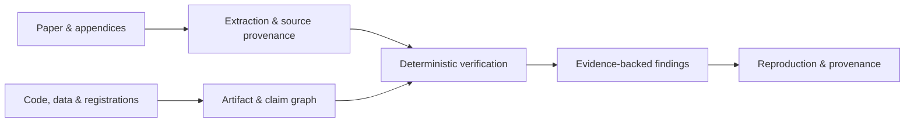

<div align="center">

# Veritas

**Evidence-first research auditing, from paper to reproducible trace.**

Upload a paper, inspect source-linked findings, attach reproduction artifacts, and follow every detector or agent run through one local-first workbench.

[](https://github.com/jiaweine/Veritas/actions/workflows/ci.yml)


</div>

Veritas is an evidence-first research audit system for empirical social science. It combines a deterministic Python verification core with a Web/PWA Research Audit Workbench, a versioned FastAPI product API, optional ACP reproduction agents, and a native Expo mobile client.

The product is built around inspectable audit objects rather than chat transcripts: papers, findings, evidence locations, run traces, parser provenance, immutable reproduction artifacts, benchmark gates, and attested outputs remain first-class data.

## Product surfaces

- **Research Audit Workbench** — dense local cockpit for Audits, Findings, Evidence, Agent Runs, Reproduction, Benchmarks, and Settings.
- **Source-first paper workbench** — PDF evidence viewer, detected structure, findings, and correlated tool traces stay linked to page/table/row provenance.
- **Versioned product API** — `/api/v1` endpoints serve audits, findings, runs, run detail, search, capabilities, benchmarks, immutable attachments, and reproduction streams.
- **Native mobile client** — Expo / React Native app shares the same `/api/v1` contract; no WebView product shell.
- **Replication agent bridge** — optional ACP integration runs against a per-run workspace with hash-verified paper/artifact copies and fail-closed permission defaults.
- **Optional parser and telemetry adapters** — Docling can add an observational third parser snapshot; OTLP export is metadata-only and opt-in.

## Research core

- **Paper-native extraction** — dual native-PDF parsing with geometry fallback and precise page/table/row/column provenance.
- **Deterministic statistical checks** — rounding-aware regression arithmetic, sample accounting, correlations, grouped summaries, ANOVA, meta-analysis, SEM, standardized regression, DID, IV, RDD, and experimental checks.
- **Evidence-linked claims** — `Claim → Estimate → Sample → Data → Code → Assumption` identity graphs keep findings tied to the objects they depend on.
- **Reproducibility workflows** — isolated R/Python runner contracts, environment capture, publication-object matching, provenance DAGs, and attested reproduction findings.
- **Research-design checks** — preregistration and PAP comparison, sample lineage, survey-integrity signals, and provenance/randomization checks.
- **Locked evaluation** — calibration scopes, held-out TEST sealing, execution attestations, release bindings, cold verification, and archive-receipt binding for real-paper extraction evidence.

## Quick start: Research Audit Workbench

```bash
git clone https://github.com/jiaweine/Veritas.git
cd Veritas
python -m venv .venv
source .venv/bin/activate
python -m pip install -e ".[web,pdf]"
veritas-harness
```

Open `http://127.0.0.1:8765` and upload a PDF. The product stores local audit records under `~/.veritas/harness` by default.

Useful operator endpoints:

```bash
veritas-harness --version
curl http://127.0.0.1:8765/api/v1/health
```

Interactive API documentation is available at `http://127.0.0.1:8765/api/docs`. The installable PWA caches only the static application shell; `/api/` responses, PDFs, attachments, and other audit data are served with `Cache-Control: no-store`.

The legacy `/api/health` route is retained for compatibility; new integrations should use `/api/v1/health` and the `/api/v1` product contract.

### Run a detector from the workbench

From an audit thread, a deterministic regression check can be requested with:

```text
/audit row="Treatment" table=2 page=1
```

The browser is a control surface: extraction and detector work remains in the Python backend, and source locations flow back into the Evidence Inspector and correlated run trace. See [`docs/HARNESS.md`](docs/HARNESS.md) and [`docs/PRODUCT_WORKBENCH.md`](docs/PRODUCT_WORKBENCH.md).

## Native mobile

The `mobile/` client is a native Expo application using the same versioned API as the Web/PWA product.

```bash
cd mobile
npm install
npx expo install --check
EXPO_PUBLIC_VERITAS_API_URL=http://127.0.0.1:8765 npx expo start
```

By default the Harness listens only on `127.0.0.1`. For a physical device, explicitly bind Veritas to a reachable trusted interface and point the app at that server, for example:

```bash
veritas-harness --host 0.0.0.0
EXPO_PUBLIC_VERITAS_API_URL=http://<trusted-host>:8765 npx expo start
```

Binding to `0.0.0.0` expands the network exposure of the local Harness. It is not an authenticated multi-user deployment boundary; use it only on a network you trust or place an appropriate authenticated HTTPS boundary in front of the service.

The mobile client supports cockpit/audit views, findings, PDF upload, immutable reproduction artifacts, ACP reproduction, persisted run history, and correlated run detail. See [`mobile/README.md`](mobile/README.md) for device-specific setup.

## Optional reproduction agent

Code-capable agents are optional and stay outside normal paper-audit threads. Veritas exposes an ACP client adapter for a dedicated replication workspace:

```bash
python -m pip install -e ".[web,pdf,replication]"
export VERITAS_REPLICATION_AGENT="my-acp-agent"
veritas-harness
```

You can also run a direct ACP turn from the CLI:

```bash
veritas-replication --workspace ./reproduction \
  "Run the project tests and identify the command that reproduces Table 4."
```

The browser/mobile client submits a reproduction goal, never a server executable command. The adapter defaults to denying ACP permission requests. Each accepted product run gets a fresh workspace containing read-only, hash-verified copies of the paper and attached artifacts plus an `artifacts.json` manifest. The workspace path is not itself a security sandbox; process and filesystem isolation belong to the selected agent runtime. See [`docs/REPLICATION_AGENT_BACKENDS.md`](docs/REPLICATION_AGENT_BACKENDS.md).

## Optional Docling parser

The locked baseline remains PyMuPDF + pdfplumber. Docling is an optional observational third parser and does not silently change the two-family promotion rule.

```bash
python -m pip install -e ".[web,pdf,docling]"
export VERITAS_PDF_THIRD_PARSER=docling
veritas-harness
```

## Optional OTLP observability

OTLP export is opt-in and occurs only after local audit events are appended. Exported spans are metadata-only: PDF bytes, audit titles, raw prompts, evidence text, arbitrary ACP messages, collector URLs, and secrets are not exported as span attributes.

```bash
python -m pip install -e ".[web,pdf,observability]"
export VERITAS_OTEL_EXPORT=true
export OTEL_EXPORTER_OTLP_ENDPOINT=http://collector:4318
veritas-harness
```

Export remains inactive unless the Veritas export flag, an explicit OTLP collector endpoint, and the optional observability dependencies are all present. The endpoint value itself is not exposed through the product API.

## Python library quick start

Install the research core plus PDF and attestation support:

```bash
python -m pip install -e ".[pdf,attestation]"
```

Run a minimal audit:

```python
from veritas import AuditEngine, RegressionResult, ReportedNumber
from veritas.types import Materiality

result = RegressionResult(
    object_id="table4-col3",
    beta=ReportedNumber(0.183, decimals=3),
    se=ReportedNumber(0.041, decimals=3),
    p_value=ReportedNumber(0.017, decimals=3),
    materiality=Materiality.MAIN_EMPIRICAL_CLAIM,
)

summary = AuditEngine().audit([result])

print(summary.verification_coverage)
print(summary.review_priority)
print(summary.findings)
```

## How it works



| Stage | What Veritas records or checks |
| --- | --- |
| Extraction | Reported values, statistical objects, source locations, parser provenance |
| Verification | Applicability, rounding intervals, numerical identities, sample and design constraints |
| Evidence graph | Claim/object identity and dependencies across paper, data, code, and assumptions |
| Reproduction | Runtime environment, immutable inputs, execution outputs, publication-object matching |
| Provenance | Locked artifacts, execution attestations, release identities, cold verification |

## Real-paper evidence workflow

The v0.15 extraction-evidence protocol provides a locked process for evaluating extraction on real papers:

```text
sampling → independent review → DEVELOPMENT calibration → sealed TEST
         → execution attestations → release bindings → cold verification
         → external archive receipt binding
```

The canonical operator sequence is documented in [`docs/EXTRACTION_EVIDENCE_RUNBOOK.md`](docs/EXTRACTION_EVIDENCE_RUNBOOK.md). Frozen v0.15 benchmark and execution manifests live under [`benchmark/extraction/`](benchmark/extraction/).

## Benchmarks

The repository includes three release-gating checks plus four non-gating probes reflected by the product benchmark inventory:

```bash
python scripts/benchmark_pdf_regression.py
python scripts/benchmark_pdf_geometry_holdout.py
python scripts/benchmark_extraction_adversarial.py

python scripts/probe_bmc_grouped_headers.py
python scripts/smoke_real_pdf.py
python scripts/smoke_real_pdf_fail_closed.py
python scripts/benchmark_real_pdf_promotion.py
```

The Workbench exposes this command inventory through `GET /api/v1/benchmarks`. It deliberately does not fabricate benchmark scores or trends when no durable benchmark result store exists.

For the full CI dependency set and test suite:

```bash
python -m pip install -e ".[dev,pdf,attestation,web,replication]"
ruff check src tests
pytest -q
```

## Repository layout

| Path | Purpose |
| --- | --- |
| [`src/veritas/`](src/veritas/) | Core audit, extraction, detector, reproduction, provenance, and product library |
| [`src/veritas/harness/`](src/veritas/harness/) | Versioned API, local audit records, tool orchestration, PWA, and Workbench UI |
| [`src/veritas/replication/`](src/veritas/replication/) | Optional ACP adapter for code-capable replication agents |
| [`mobile/`](mobile/) | Native Expo / React Native client using `/api/v1` |
| [`scripts/`](scripts/) | Benchmark, evidence-building, and verification CLIs |
| [`benchmark/`](benchmark/) | Benchmark corpora plus frozen evidence and execution manifests |
| [`docs/`](docs/) | Product architecture, methods, detector notes, evidence protocols, and runbooks |
| [`tests/`](tests/) | Unit, regression, fail-closed, API, replication, and workflow contract tests |

## Documentation

- [`docs/PRODUCT_WORKBENCH.md`](docs/PRODUCT_WORKBENCH.md) — product architecture, workbench model, versioned API, mobile, parser stack, and observability
- [`docs/HARNESS.md`](docs/HARNESS.md) — Research Audit Workbench backend architecture and local workflow
- [`mobile/README.md`](mobile/README.md) — native mobile setup and device connectivity
- [`docs/REPLICATION_AGENT_BACKENDS.md`](docs/REPLICATION_AGENT_BACKENDS.md) — ACP replication agents, backend choices, and safety boundaries
- [`docs/METHODS.md`](docs/METHODS.md) — audit model and methodology
- [`docs/DETECTOR_CARDS.md`](docs/DETECTOR_CARDS.md) — detector scope and assumptions
- [`docs/EXTRACTION.md`](docs/EXTRACTION.md) — extraction architecture
- [`docs/CLAIM_GRAPH_IDENTITY.md`](docs/CLAIM_GRAPH_IDENTITY.md) — claim and evidence identity
- [`docs/REPRODUCIBILITY_ARTIFACTS.md`](docs/REPRODUCIBILITY_ARTIFACTS.md) — reproduction artifacts and provenance
- [`docs/DATA_PREREGISTRATION_INTEGRITY.md`](docs/DATA_PREREGISTRATION_INTEGRITY.md) — preregistration, lineage, and integrity checks
- [`docs/EXTRACTION_EVIDENCE_RUNBOOK.md`](docs/EXTRACTION_EVIDENCE_RUNBOOK.md) — v0.15 real-paper evidence workflow
- [`docs/ROADMAP.md`](docs/ROADMAP.md) — project roadmap

## Research status

Veritas is research software. Current public real-PDF benchmarks run under benchmark/research calibration; production-authorized hard findings require the locked held-out certification path for the exact deployed pipeline.

Findings are designed to support expert review and reproducibility work, not to serve as determinations of research misconduct.
