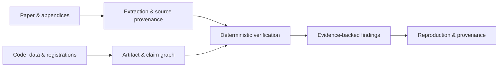

<div align="center">

# Veritas

**Evidence-first auditing for empirical social science.**

Turn papers and research artifacts into inspectable, reproducible audit evidence.

[](https://github.com/jiaweine/Veritas/actions/workflows/ci.yml)


</div>

Veritas extracts reported statistical objects from research papers, checks numerical and methodological consistency with deterministic detectors, links findings back to source evidence, and carries the result through reproducibility and provenance workflows.

## Highlights

- **Research Audit Workbench / PWA** — an information-dense local product with Overview, Audits, Findings, Agent Runs, Evidence, Reproduction, Benchmarks, Settings, a command palette, and an optional Agent sidecar.
- **Versioned product API** — Web and native mobile clients share `/api/v1`, including capabilities, overview, findings, runs, search, audits, immutable attachments, and reproduction streams.
- **Native mobile client** — an Expo / React Native app for cockpit, audits, findings, native PDF upload, immutable reproduction artifacts, replication, and persisted run inspection without embedding the web UI in a WebView.
- **Paper-native extraction** — dual native-PDF parsing with geometry fallback and precise page/table/row/column provenance.
- **Deterministic statistical checks** — rounding-aware regression arithmetic, sample accounting, correlations, grouped summaries, ANOVA, meta-analysis, SEM, standardized regression, DID, IV, RDD, and experimental checks.
- **Evidence-linked claims** — `Claim → Estimate → Sample → Data → Code → Assumption` identity graphs keep findings tied to the objects they depend on.
- **Reproducibility workflows** — isolated R/Python runner contracts, environment capture, publication-object matching, provenance DAGs, immutable artifact intake, and attested reproduction findings.
- **Replication agent bridge** — optional ACP integration keeps code-capable agents in a separate per-run replication workspace instead of granting shell access to paper-audit threads.
- **Research-design checks** — preregistration and PAP comparison, sample lineage, survey-integrity signals, and provenance/randomization checks.
- **Locked evaluation** — calibration scopes, held-out TEST sealing, execution attestations, release bindings, cold verification, and archive-receipt binding for real-paper extraction evidence.

## Quick start

```bash
git clone https://github.com/jiaweine/Veritas.git
cd Veritas
python -m venv .venv
source .venv/bin/activate
python -m pip install -e ".[pdf,attestation]"
```

Run a minimal audit:

```python
from veritas import AuditEngine, RegressionResult, ReportedNumber
from veritas.types import Materiality

result = RegressionResult(
    object_id="table4-col3",
    beta=ReportedNumber(0.183, decimals=3),
    se=ReportedNumber(0.041, decimals=3),
    p_value=ReportedNumber(0.017, decimals=3),
    materiality=Materiality.MAIN_EMPIRICAL_CLAIM,
)

summary = AuditEngine().audit([result])

print(summary.verification_coverage)
print(summary.review_priority)
print(summary.findings)
```

### Launch the Product Workbench

```bash
python -m pip install -e ".[web,pdf]"
veritas-harness
```

Open `http://127.0.0.1:8765`. The default product is a dashboard-first audit workbench rather than a chat transcript: upload a paper, inspect source evidence, review findings and correlated runs, prepare immutable reproduction artifacts, inspect CI benchmark inventory, and open Settings to see the active parser / ACP / observability boundary.

The installable PWA caches only the static shell. `/api/` responses, PDFs, attachments, and other audit data are served with `Cache-Control: no-store`. FastAPI docs are available at `/api/docs`.

For the API and product architecture, see [`docs/PRODUCT_WORKBENCH.md`](docs/PRODUCT_WORKBENCH.md). For the Harness internals and local workflow, see [`docs/HARNESS.md`](docs/HARNESS.md).

### Connect a replication agent

Code-capable agents are optional and stay outside normal paper-audit threads. Veritas exposes an ACP client adapter for a dedicated replication workspace:

```bash
python -m pip install -e ".[replication]"
export VERITAS_REPLICATION_AGENT="my-acp-agent"
veritas-replication --workspace ./reproduction \
  "Run the project tests and identify the command that reproduces Table 4."
```

The product workbench uses the same server-selected ACP boundary. Browser and mobile clients provide only a reproduction goal; they cannot provide the executable command. Permission requests default to deny, uploaded artifacts are hashed and staged read-only into a new per-run workspace, and the workspace path is not itself a security sandbox. Process and filesystem isolation belong to the selected agent runtime. See [`docs/REPLICATION_AGENT_BACKENDS.md`](docs/REPLICATION_AGENT_BACKENDS.md).

### Run the native mobile client

The `mobile/` app is a native Expo / React Native client, not a WebView wrapper:

```bash
cd mobile
npm install
npx expo install --check
npx expo start
```

By default the Harness listens only on `127.0.0.1`. A simulator can use an appropriate loopback/host mapping. For a physical device, explicitly start the Harness on a reachable trusted interface and point the app at it, for example:

```bash
veritas-harness --host 0.0.0.0
EXPO_PUBLIC_VERITAS_API_URL=http://<trusted-host>:8765 npx expo start
```

Binding to `0.0.0.0` expands the network exposure of the local Harness. It is not a substitute for an authenticated multi-user deployment boundary; use it only on a network you trust or put an appropriate authenticated HTTPS boundary in front of the service. See [`mobile/README.md`](mobile/README.md).

### Optional parser and observability integrations

The core install does not require Docling or OpenTelemetry. Enable them explicitly when needed:

```bash
# Optional independent third parser; observational only.
python -m pip install -e ".[docling]"
export VERITAS_PDF_THIRD_PARSER=docling

# Optional metadata-only OTLP export.
python -m pip install -e ".[observability]"
export VERITAS_OTEL_EXPORT=true
export OTEL_EXPORTER_OTLP_ENDPOINT=http://collector:4318
```

Docling does not change the locked two-family consensus/promotion rule. OTLP export is fail-closed unless both the export flag and an explicit collector endpoint are configured, and it does not export paper bytes, raw reproduction prompts, evidence text, or audit titles.

## How it works



| Stage | What Veritas records or checks |
| --- | --- |
| Extraction | Reported values, statistical objects, source locations, parser provenance |
| Verification | Applicability, rounding intervals, numerical identities, sample and design constraints |
| Evidence graph | Claim/object identity and dependencies across paper, data, code, and assumptions |
| Reproduction | Runtime environment, immutable inputs, execution outputs, publication-object matching |
| Provenance | Locked artifacts, execution attestations, release identities, cold verification |

## Real-paper evidence workflow

The v0.15 evidence workflow provides a locked protocol for evaluating extraction on real papers:

```text
sampling → independent review → DEVELOPMENT calibration → sealed TEST
         → execution attestations → release bindings → cold verification
         → external archive receipt binding
```

The canonical operator sequence is documented in [`docs/EXTRACTION_EVIDENCE_RUNBOOK.md`](docs/EXTRACTION_EVIDENCE_RUNBOOK.md). Frozen v0.15 benchmark and execution manifests live under [`benchmark/extraction/`](benchmark/extraction/).

## Benchmarks

The repository includes regression, geometry-holdout, adversarial, and real-PDF promotion checks:

```bash
python scripts/benchmark_pdf_regression.py
python scripts/benchmark_pdf_geometry_holdout.py
python scripts/benchmark_extraction_adversarial.py
python scripts/benchmark_real_pdf_promotion.py
```

The Product Workbench exposes the command inventory through `GET /api/v1/benchmarks`; it deliberately does not fabricate benchmark scores or trends when no durable result store exists.

For the full test suite:

```bash
python -m pip install -e ".[dev,pdf,attestation,web,replication]"
ruff check src tests
pytest -q
```

## Repository layout

| Path | Purpose |
| --- | --- |
| [`src/veritas/`](src/veritas/) | Core audit, extraction, detector, reproduction, provenance, and harness library |
| [`src/veritas/harness/`](src/veritas/harness/) | Versioned API, local audit store, product orchestration, and dependency-light Web/PWA UI |
| [`src/veritas/replication/`](src/veritas/replication/) | Optional ACP adapter for code-capable replication agents |
| [`mobile/`](mobile/) | Native Expo / React Native client sharing the `/api/v1` contract |
| [`scripts/`](scripts/) | Benchmark, evidence-building, and verification CLIs |
| [`benchmark/`](benchmark/) | Benchmark corpora plus frozen evidence and execution manifests |
| [`docs/`](docs/) | Methods, product architecture, evidence protocols, and operator runbooks |
| [`tests/`](tests/) | Unit, regression, fail-closed, harness, replication, and workflow contract tests |

## Documentation

- [`docs/PRODUCT_WORKBENCH.md`](docs/PRODUCT_WORKBENCH.md) — Web/PWA/mobile product architecture, `/api/v1`, parser, ACP, benchmark, and OTLP boundaries
- [`docs/HARNESS.md`](docs/HARNESS.md) — Research Audit Harness architecture and local workflow
- [`mobile/README.md`](mobile/README.md) — native mobile setup
- [`docs/REPLICATION_AGENT_BACKENDS.md`](docs/REPLICATION_AGENT_BACKENDS.md) — ACP replication agents, backend choices, and safety boundaries
- [`docs/METHODS.md`](docs/METHODS.md) — audit model and methodology
- [`docs/DETECTOR_CARDS.md`](docs/DETECTOR_CARDS.md) — detector scope and assumptions
- [`docs/EXTRACTION.md`](docs/EXTRACTION.md) — extraction architecture
- [`docs/CLAIM_GRAPH_IDENTITY.md`](docs/CLAIM_GRAPH_IDENTITY.md) — claim and evidence identity
- [`docs/REPRODUCIBILITY_ARTIFACTS.md`](docs/REPRODUCIBILITY_ARTIFACTS.md) — reproduction artifacts and provenance
- [`docs/DATA_PREREGISTRATION_INTEGRITY.md`](docs/DATA_PREREGISTRATION_INTEGRITY.md) — preregistration, lineage, and integrity checks
- [`docs/EXTRACTION_EVIDENCE_RUNBOOK.md`](docs/EXTRACTION_EVIDENCE_RUNBOOK.md) — v0.15 real-paper evidence workflow
- [`docs/ROADMAP.md`](docs/ROADMAP.md) — project roadmap

## Research status

Veritas is research software. Current public real-PDF benchmarks run under benchmark/research calibration; production-authorized hard findings require the locked held-out certification path for the exact deployed pipeline.

Findings are designed to support expert review and reproducibility work, not to serve as determinations of research misconduct.
