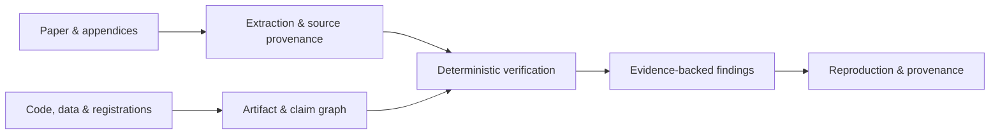

<div align="center">

# Veritas

**Evidence-first auditing for empirical social science.**

Turn papers and research artifacts into inspectable, reproducible audit evidence.

[](https://github.com/jiaweine/Veritas/actions/workflows/ci.yml)


</div>

Veritas extracts reported statistical objects from research papers, checks numerical and methodological consistency with deterministic detectors, links findings back to source evidence, and carries the result through reproducibility and provenance workflows.

## Highlights

- **Paper-native extraction** — dual native-PDF parsing with geometry fallback and precise page/table/row/column provenance.
- **Deterministic statistical checks** — rounding-aware regression arithmetic, sample accounting, correlations, grouped summaries, ANOVA, meta-analysis, SEM, standardized regression, DID, IV, RDD, and experimental checks.
- **Evidence-linked claims** — `Claim → Estimate → Sample → Data → Code → Assumption` identity graphs keep findings tied to the objects they depend on.
- **Reproducibility workflows** — isolated R/Python runner contracts, environment capture, publication-object matching, provenance DAGs, and attested reproduction findings.
- **Research-design checks** — preregistration and PAP comparison, sample lineage, survey-integrity signals, and provenance/randomization checks.
- **Locked evaluation** — calibration scopes, held-out TEST sealing, execution attestations, release bindings, cold verification, and archive-receipt binding for real-paper extraction evidence.

## Quick start

```bash
git clone https://github.com/jiaweine/Veritas.git
cd Veritas
python -m venv .venv
source .venv/bin/activate
python -m pip install -e ".[pdf,attestation]"
```

Run a minimal audit:

```python
from veritas import AuditEngine, RegressionResult, ReportedNumber
from veritas.types import Materiality

result = RegressionResult(
    object_id="table4-col3",
    beta=ReportedNumber(0.183, decimals=3),
    se=ReportedNumber(0.041, decimals=3),
    p_value=ReportedNumber(0.017, decimals=3),
    materiality=Materiality.MAIN_EMPIRICAL_CLAIM,
)

summary = AuditEngine().audit([result])

print(summary.verification_coverage)
print(summary.review_priority)
print(summary.findings)
```

## How it works



| Stage | What Veritas records or checks |
| --- | --- |
| Extraction | Reported values, statistical objects, source locations, parser provenance |
| Verification | Applicability, rounding intervals, numerical identities, sample and design constraints |
| Evidence graph | Claim/object identity and dependencies across paper, data, code, and assumptions |
| Reproduction | Runtime environment, execution inputs/outputs, publication-object matching |
| Provenance | Locked artifacts, execution attestations, release identities, cold verification |

## Real-paper evidence workflow

Veritas v0.15 includes a locked workflow for evaluating extraction on real papers:

```text
sampling → independent review → DEVELOPMENT calibration → sealed TEST
         → execution attestations → release bindings → cold verification
         → external archive receipt binding
```

The canonical operator sequence is documented in [`docs/EXTRACTION_EVIDENCE_RUNBOOK.md`](docs/EXTRACTION_EVIDENCE_RUNBOOK.md). Frozen v0.15 benchmark and execution manifests live under [`benchmark/extraction/`](benchmark/extraction/).

## Benchmarks

The repository includes regression, geometry-holdout, adversarial, and real-PDF promotion checks:

```bash
python scripts/benchmark_pdf_regression.py
python scripts/benchmark_pdf_geometry_holdout.py
python scripts/benchmark_extraction_adversarial.py
python scripts/benchmark_real_pdf_promotion.py
```

For the full test suite:

```bash
python -m pip install -e ".[dev,pdf,attestation]"
ruff check src tests
pytest -q
```

## Repository layout

| Path | Purpose |
| --- | --- |
| [`src/veritas/`](src/veritas/) | Core audit, extraction, detector, reproduction, and provenance library |
| [`scripts/`](scripts/) | Benchmark, evidence-building, and verification CLIs |
| [`benchmark/`](benchmark/) | Benchmark corpora plus frozen evidence and execution manifests |
| [`docs/`](docs/) | Methods, detector notes, evidence protocols, and operator runbooks |
| [`tests/`](tests/) | Unit, regression, fail-closed, and workflow contract tests |

## Documentation

- [`docs/METHODS.md`](docs/METHODS.md) — audit model and methodology
- [`docs/DETECTOR_CARDS.md`](docs/DETECTOR_CARDS.md) — detector scope and assumptions
- [`docs/EXTRACTION.md`](docs/EXTRACTION.md) — extraction architecture
- [`docs/CLAIM_GRAPH_IDENTITY.md`](docs/CLAIM_GRAPH_IDENTITY.md) — claim and evidence identity
- [`docs/REPRODUCIBILITY_ARTIFACTS.md`](docs/REPRODUCIBILITY_ARTIFACTS.md) — reproduction artifacts and provenance
- [`docs/DATA_PREREGISTRATION_INTEGRITY.md`](docs/DATA_PREREGISTRATION_INTEGRITY.md) — preregistration, lineage, and integrity checks
- [`docs/EXTRACTION_EVIDENCE_RUNBOOK.md`](docs/EXTRACTION_EVIDENCE_RUNBOOK.md) — v0.15 real-paper evidence workflow
- [`docs/ROADMAP.md`](docs/ROADMAP.md) — project roadmap

## Research status

Veritas v0.15 is research software. Current public real-PDF benchmarks run under benchmark/research calibration; production-authorized hard findings require the locked held-out certification path for the exact deployed pipeline.

Findings are designed to support expert review and reproducibility work, not to serve as determinations of research misconduct.
