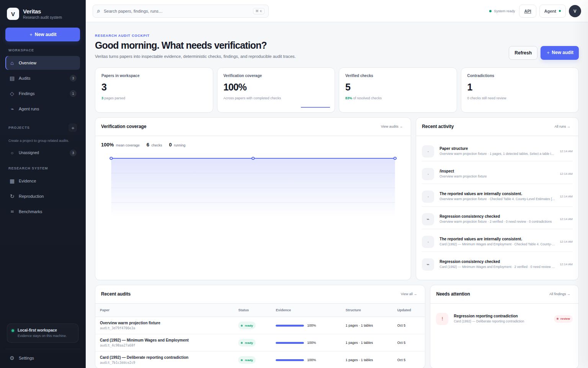
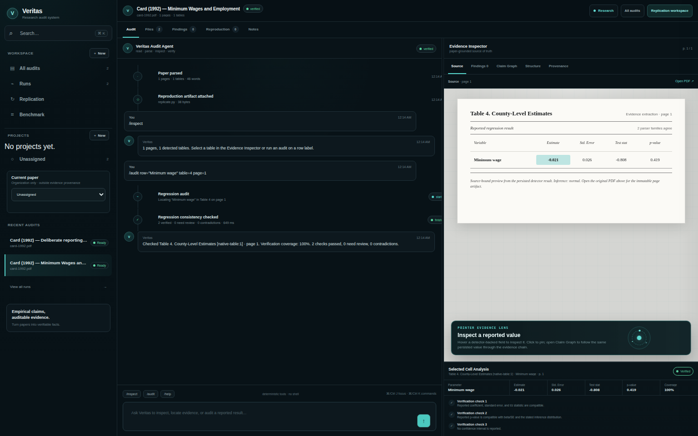
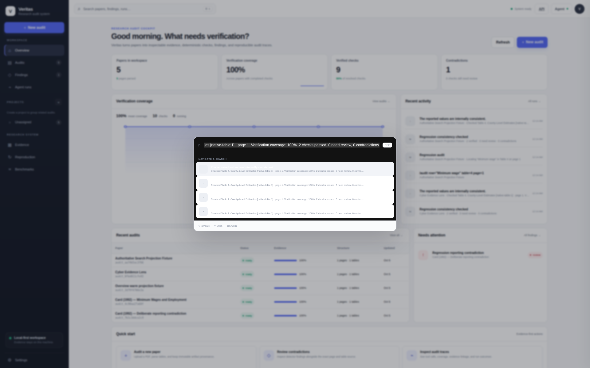

# Veritas

### Evidence-first research auditing, in one connected workspace.

Turn papers, reported results, source evidence, findings, and reproduction work into a review trail you can inspect from end to end.

  

## From paper to review, without losing context

Veritas brings the full research-review workflow into a single workspace. Start with a paper, inspect the values it reports, review the evidence behind them, follow findings back to their source, and carry important questions into reproduction work without breaking the thread of the review.

| Inspect | Verify | Trace | Reproduce |
| --- | --- | --- | --- |
| Read reported results in the context of the paper. | Review consistency checks and the evidence behind each result. | Move between findings, source evidence, and the claims they support. | Keep reproduction work connected to the question that started it. |

## Evidence stays attached to the result

The **Audit Workbench** keeps the paper, review timeline, selected result, and evidence inspector together. The **Evidence Lens** lets you focus on a reported value while preserving the surrounding table and review context, so the path from “this looks unusual” to “show me exactly where it came from” stays short.

  

## One review, many connected views

Veritas is designed as a workspace rather than a collection of disconnected reports. Each surface answers a different question while keeping you inside the same review:

| Surface | What it helps you do |
| --- | --- |
| **Overview** | See the state of the research workspace, recent activity, papers, and review signals at a glance. |
| **Audits** | Work through a paper with its source material, timeline, notes, evidence, and findings together. |
| **Findings** | Focus on contradictions and review signals that deserve attention. |
| **Claim Graph** | Explore how reported results, evidence, and research objects relate to the claims around them. |
| **Reproduction** | Carry a finding into a reproduction workspace and keep the resulting review attached to its scientific context. |
| **Agent Runs** | Revisit audit and reproduction activity without losing the paper or finding that initiated it. |
| **Search** | Jump directly to papers, findings, runs, and audit events from anywhere in the workspace. |
| **Mobile** | Keep the audit cockpit, papers, findings, and reproduction context close when you are away from the desktop workbench. |

## Find the exact moment you need

As the workspace grows, the command search gives you a fast way back to the paper, finding, run, or audit event you were thinking about. Search lives above the whole product, so navigation does not depend on remembering which screen contained the detail.

  

## Follow the question all the way through

A useful research review rarely ends at a single warning. Veritas lets you move from a reported value to its source evidence, from evidence to a finding, from a finding into the surrounding claim structure, and from there into reproduction work when a result deserves a deeper look.

**Paper → Reported result → Source evidence → Finding → Claim relationships → Reproduction → Review trail**

That connected path is the core of Veritas: every important review action stays close to the research object that gave it meaning.

## Made for serious research review

Veritas fits the moments when a paper needs more than a quick read — replication, peer review, evidence synthesis, research-quality checks, or simply understanding how a reported result was produced. The workspace is built to help researchers and reviewers stay oriented while moving between the paper, the evidence, and the work required to examine it closely.

---

**Veritas turns reported results into evidence you can inspect, trace, and revisit.**

